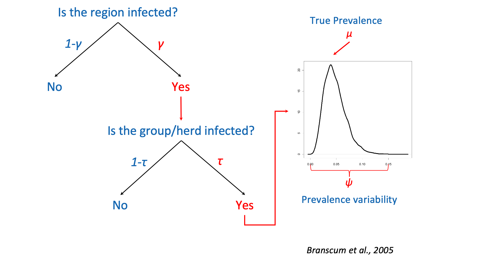
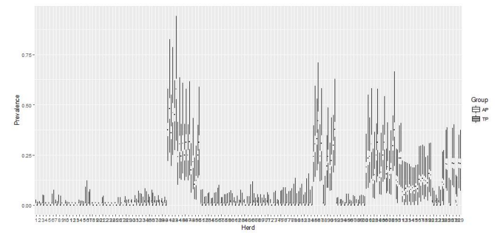
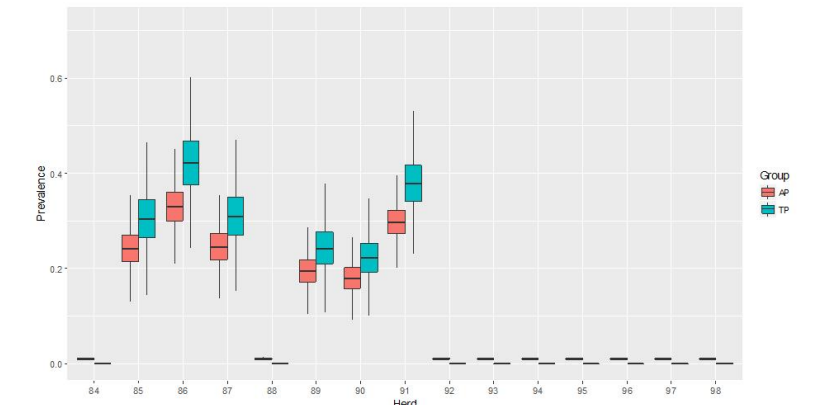
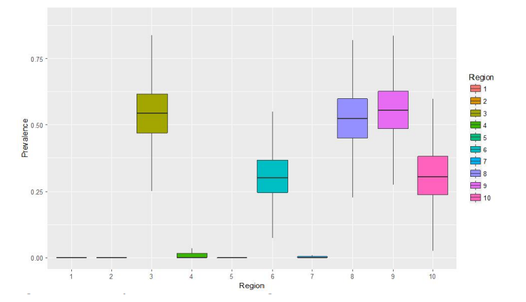

```{r setup, include=FALSE}
knitr::opts_chunk$set(echo = FALSE)
```

## Objectives of this Section

* Understand the full hierarchical model


## Bayesian hierarchical true prevalence estimation


### Model breakdown

\vspace{0.5cm}

Captures the population structure and is divided in three parts that describe distribution of disease:


* Within herds which are
* Within regions in the
* Country under consideration

## Full Model Figure



## Model outputs

* Animal-level true prevalence of infection within infected herds
* Herd-level prevalence of infection in the region
* Region-level prevalence of infection
* Probability that the whole country is free from infection
* Probability of freedom from infection at each level of hierarchy
* Probability that infection does not exceed a pre-specified critical level (e.g. 5%) in a specific region

## Run the model with JAGS

The model and the data are already saved in the Section's folder.

Let's load and view the data.

```{r}
load(file="hier_data.Rdata")
```

```{r, echo=FALSE}
head(data.frame(hier_data[1:3]))
psi = list(chain1=0.5)
```

## Run the model
```{r, echo=FALSE, include=FALSE, warning=FALSE, cache=FALSE, message=FALSE}
hier_model <- run.jags("hier_model.txt",data=hier_data,
                       burnin=5000, sample=25000)
```

```{r, echo=FALSE, include=FALSE, warning=FALSE, cache=FALSE, message=FALSE}
res <- summary(hier_model)
```

## Visualise results (I)

### ap & tp in each herd

```{r, include=FALSE}
## Code for plots
```



## Visualise results (II)



## Visualise results (III)

### Herd-level prevalence in each region



## Conclusions

* Questions???

Suggested literature

* Kostoulas et al, (2019) Harmonisation Of Transmissible disease Interpretation in the EU  HOTLINE
* Branscum et al, (2004) Bayesian modeling of animal- and herd-level prevalences